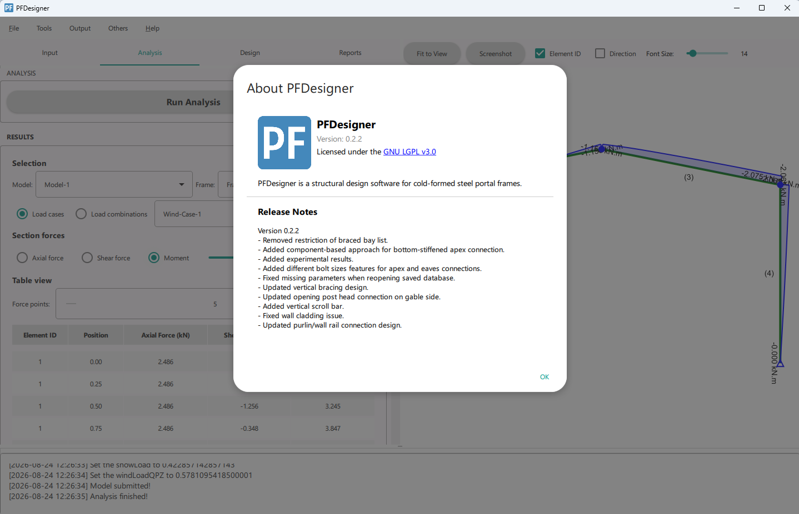

# Industry-University Collaboration: Portal Frame Design Software
University of Aberdeen × Bespoke Steel Buildings Ltd, UK

1. Led development of a Python-based structural design tool with an industrial partner, translating Eurocode requirements and engineering methodologies into practitioner-facing software.
1. Integrated structural analysis, section databases, automated design verification, reporting and visualisation within the software workflow.
1. Engaged with the industrial partner to translate practical design requirements into computational methods and software functionality.

{width=60%}

# Structural Engineering Projects (2018-2020)

1. Conducted a post-event on-site investigation of a steel warehouse collapse following a snow event, assessed the structural failure mechanism and contributing causes, and prepared a technical investigation report.
1. Conducted safety assessment of a steel warehouse.
1. Performed structural inspection of the exhibition hall (Pit 1) at the Emperor Qinshihuang's Mausoleum Site Museum (Terracotta Army).
1. Completed retrofit design for a 50 MW molten salt solar power tower.
