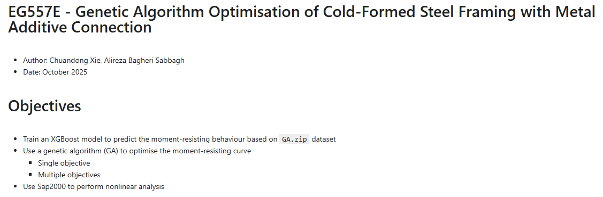

# 2025-2026
## Modern Construction (EG557E, EG557F), UoA, UK
Contributed to course design and delivered lectures/tutorials on machine learning, genetic algorithms and SAP2000-based structural modelling, with applications to cold-formed steel structures incorporating metal additive-manufacturing connections.

{width=80%}

## MSc Individual Project (EG59M2), UoA, UK
Co-supervised MSc research projects on adaptive cold-formed steel structural system incorporating metal additive-manufacturing connections; provided technical guidance on SAP2000 and Eurocode-based structural design; supported students in developing critical-thinking, problem-solving and independent research skills.

## \bf EG45PE/EG45PF and EG45PC/EG45PD Individual Project, UoA, UK
Co-supervised undergraduate individual research projects in advanced structural modelling and analysis focusing on lightweight structural systems with metal additive-manufacturing connections.

# 2024 - 2025
## Advanced Structural Analysis (EA4026), UoA, UK
Contributed to the delivery of the course in structural modelling and design.

## MSc Individual Project (EG59M2), UoA, UK
Co-supervised MSc research projects and provided technical consultation.

## EG45PE/EG45PF and EG45PC/EG45PD Individual Project, UoA, UK
Co-upervised undergraduate individual projects and provided technical consultation. 